# 🏥 VITA - Sistema de Gestão Clínica Inteligente


Sistema web completo para gerenciamento de clínicas e profissionais da saúde, desenvolvido utilizando **ASP.NET Core Web API (.NET 8)**, **React + TypeScript**, **SQL Server** e autenticação **JWT**.

# 🎯 Objetivo

O VITA é uma plataforma SaaS desenvolvida para auxiliar profissionais da área da saúde na gestão completa de clínicas e consultórios.

O sistema permite controlar pacientes, consultas, exames, históricos clínicos, receitas médicas e especialidades em uma única plataforma moderna e segura.

---

# 🚀 Tecnologias

## Backend

- ASP.NET Core Web API (.NET 8)
- Entity Framework Core
- SQL Server
- JWT Authentication
- AutoMapper
- FluentValidation
- BCrypt
- Swagger

## Frontend

- React
- TypeScript
- Vite
- Axios
- React Router
- CSS3

---

# 🏗️ Arquitetura

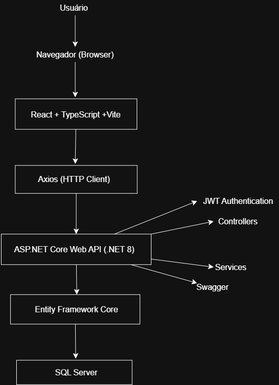

---

## 🗄️ Modelo de Dados

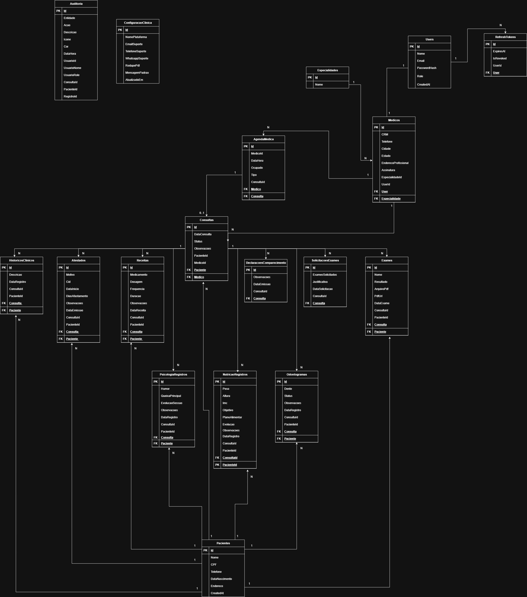

---

# ✨ Funcionalidades

## Administrador

- Login com JWT
- Dashboard administrativo
- Cadastro de médicos
- Aprovação de médicos
- Gerenciamento de pacientes
- Gerenciamento de consultas
- Gerenciamento de exames
- Histórico clínico
- Controle de especialidades

## Médico

- Login seguro
- Dashboard personalizado
- Visualização de pacientes
- Consultas
- Solicitação de exames
- Histórico clínico

---

# 🩺 Especialidades

- Odontologia
- Psicologia
- Nutrição

---

# 📷 Telas do Sistema

## Login

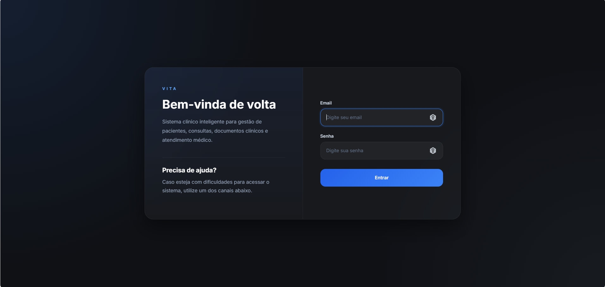

---

## Dashboard Administrador

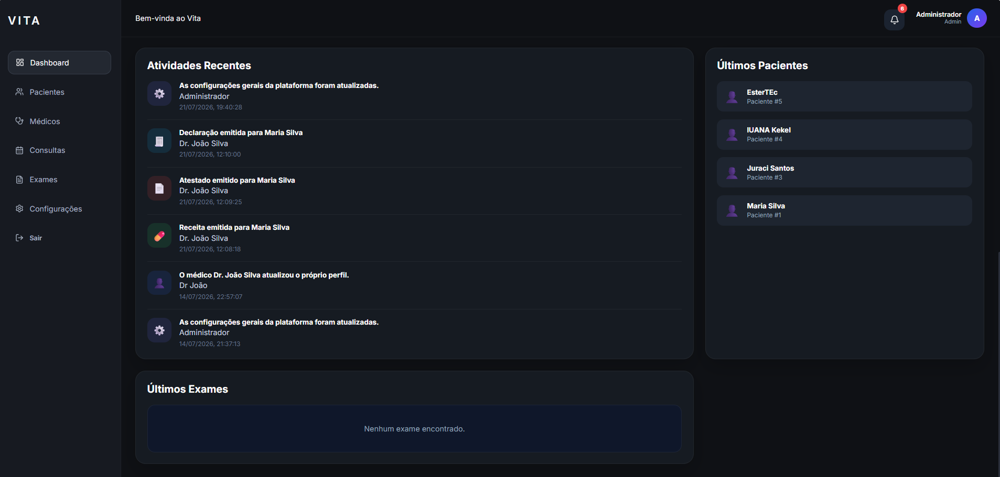


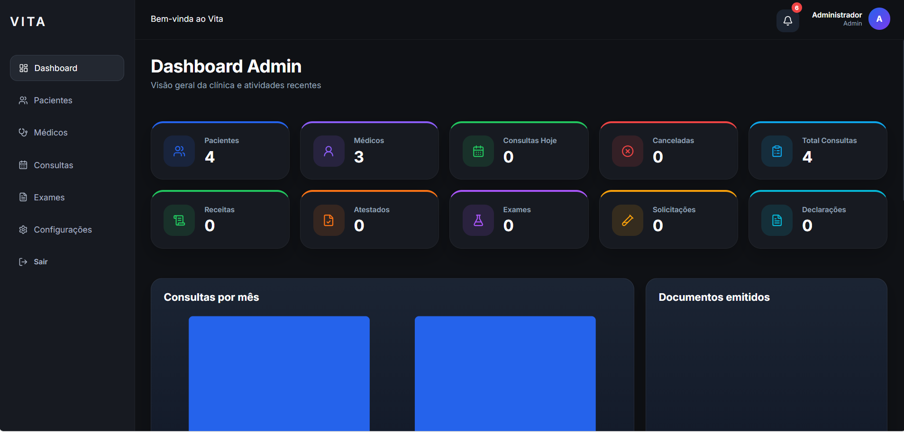

---

## Dashboard Médico

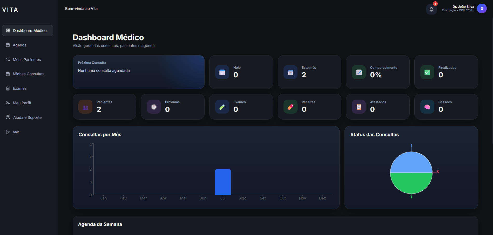


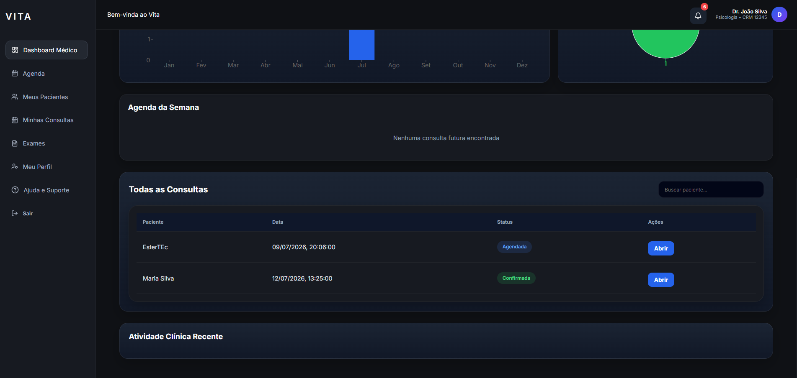


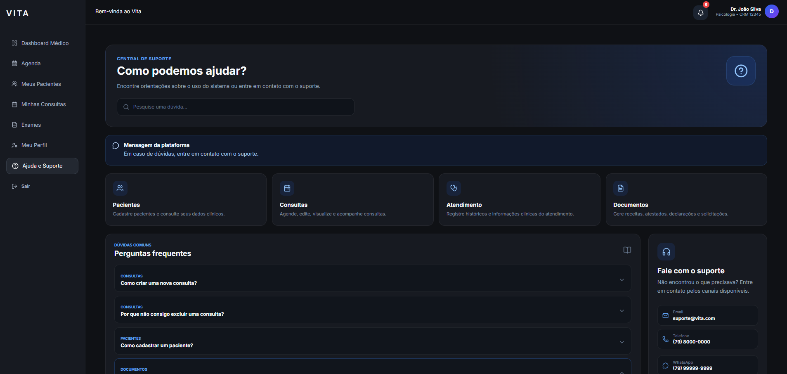

---

## Pacientes

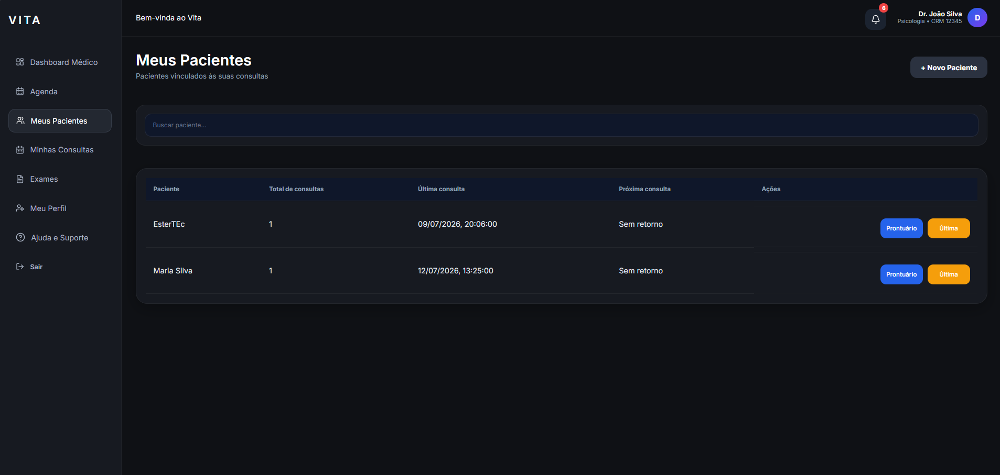


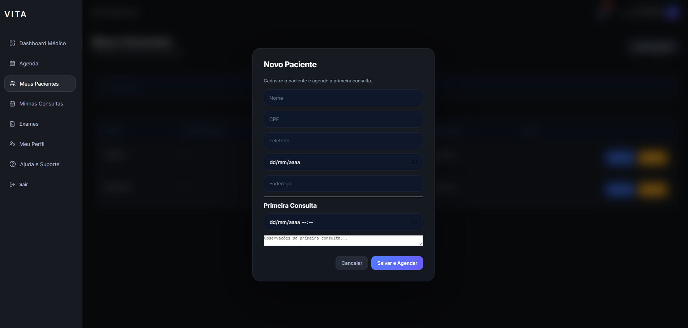

---

## Consultas

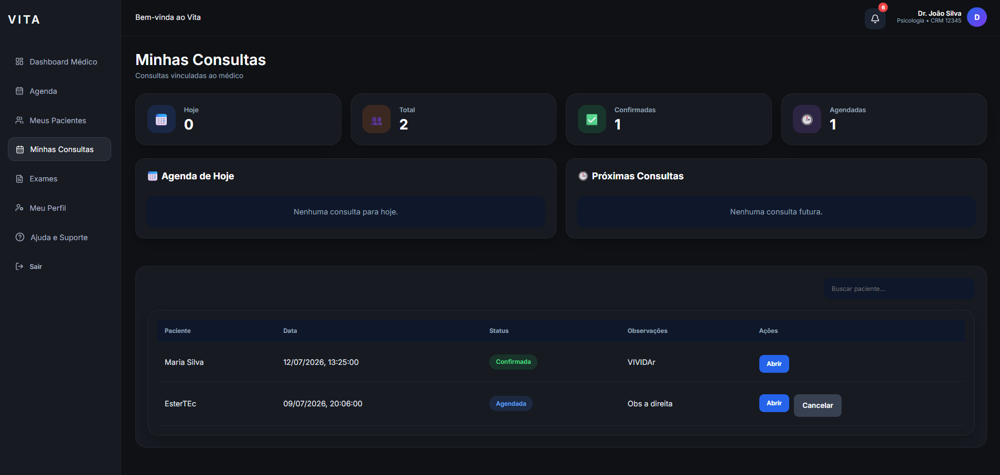


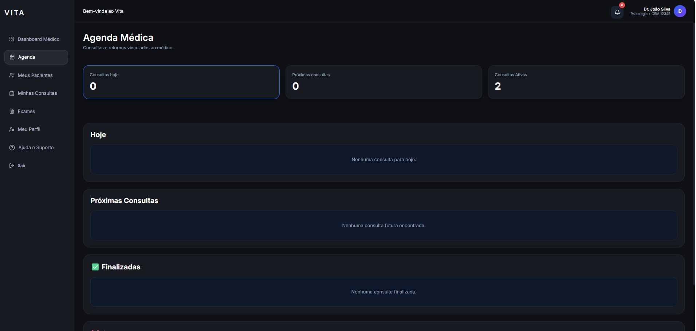


---

## Exames

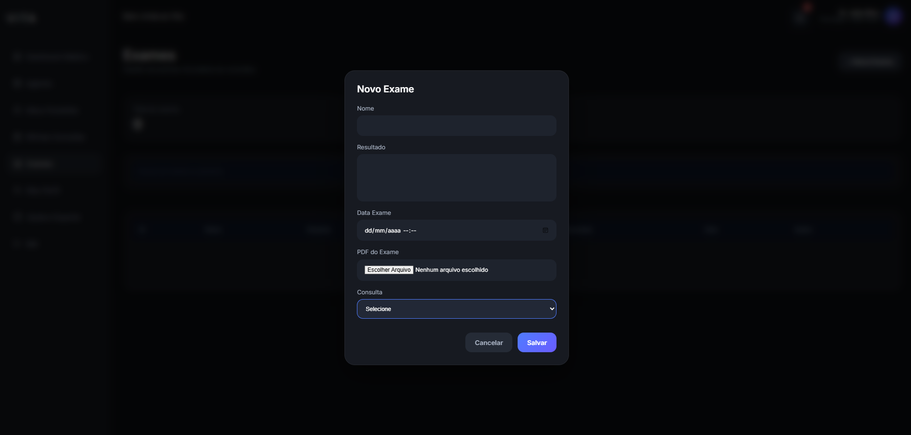


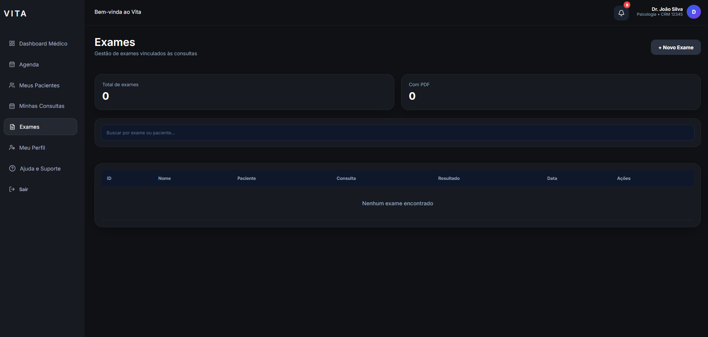

---

## Histórico Clínico

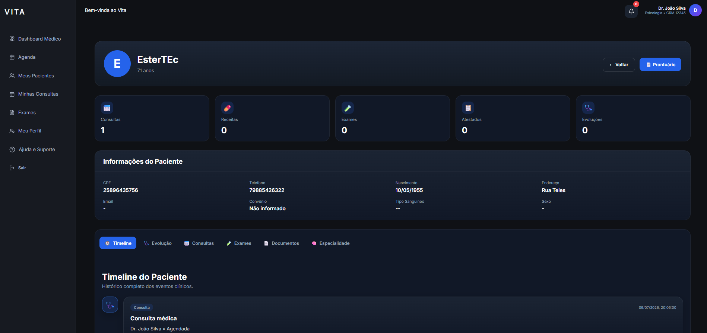

---

## Cadastro de Médicos

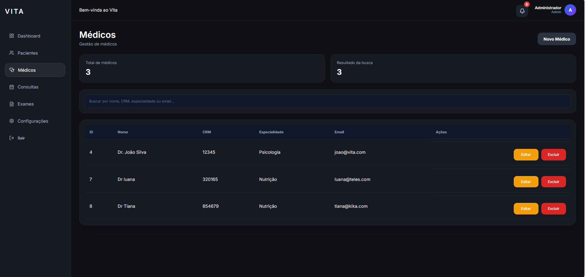


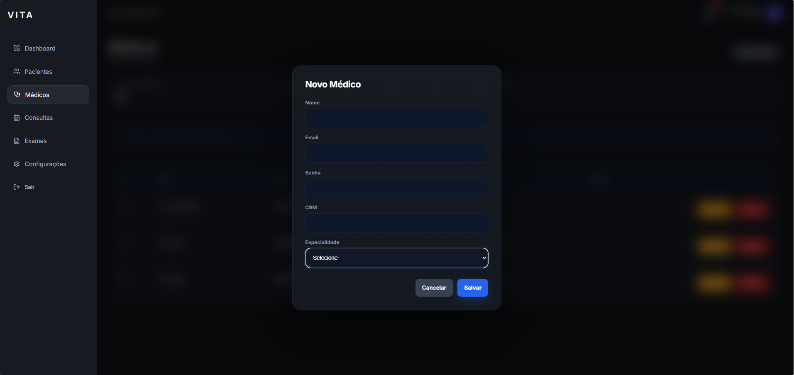


---

## Área do Profissional

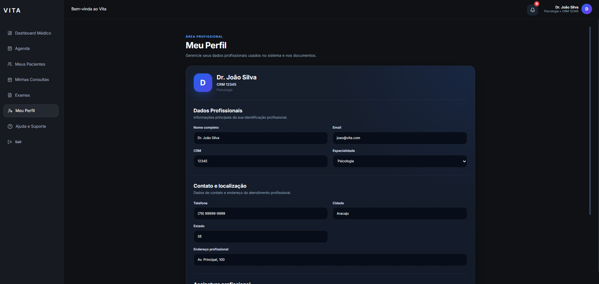

---


# 🔐 Autenticação

O sistema utiliza autenticação baseada em **JWT (JSON Web Token)**.

Recursos implementados:

- Login seguro
- Autorização por perfis
- Tokens JWT
- Refresh Token
- Controle de permissões

---

# 📂 Estrutura do Projeto

```
VITA
│
├── VitaApi
│   ├── Controllers
│   ├── DTOs
│   ├── Models
│   ├── Services
│   ├── Repositories
│   ├── Data
│   └── Program.cs
│
├── vita-project
│   ├── src
│   ├── components
│   ├── pages
│   ├── services
│   └── assets
│
├── docs
│   └── images
│
└── README.md
```

---

# ⚙️ Como Executar

## Backend

Clone o projeto

```bash
git clone https://github.com/SEU-USUARIO/VITA.git

cd VITA
```

Entre na API

```bash
cd VitaApi
```

Configure o **User Secrets**:

```json
{
  "ConnectionStrings": {
    "DefaultConnection": "SUA_CONNECTION_STRING"
  },
  "Jwt": {
    "Key": "SUA_CHAVE_JWT"
  }
}
```

Execute:

```bash
dotnet restore
dotnet ef database update
dotnet run
```

---

## Frontend

Entre na pasta do frontend

```bash
cd vita-project
```

Instale as dependências

```bash
npm install
```

Crie um arquivo `.env`:

```env
VITE_API_URL=http://localhost:5182/api
```

Execute:

```bash
npm run dev
```

---

# 📌 Próximas Funcionalidades

- Upload de imagens
- Dashboard com gráficos
- Notificações em tempo real
- Agendamento online
- Relatórios em PDF
- Deploy em nuvem

---

# 👩‍💻 Desenvolvido por

**Ester da Costa Batista**

Desenvolvedora Full Stack

- C#
- .NET
- React
- TypeScript
- SQL Server

GitHub:

https://github.com/Rester-fullstack


---

# 📄 Licença

Este projeto foi desenvolvido para fins de estudo, aprendizado e demonstração de portfólio.